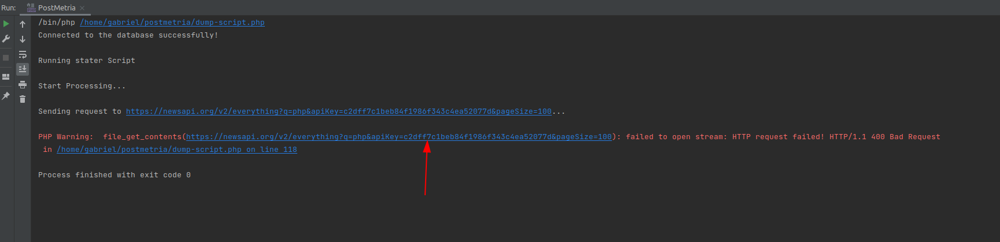
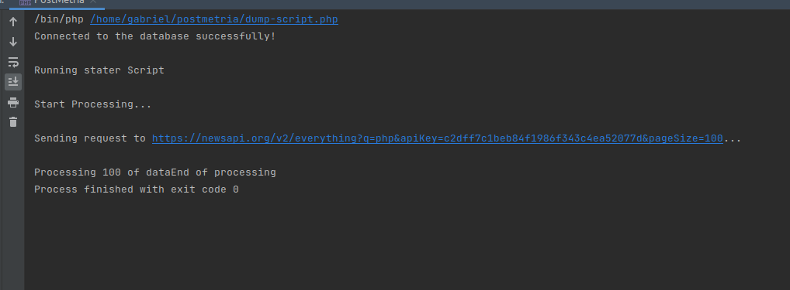

<p align="center">
    <h1 align="center">Exercício de programação</h1>
</p>


### Script de Banco de Dados

O arquivo `init.sql` possui em seu conteúdo o script de criação do banco e suas respectivas tabelas, para o banco de dados foi utilizado um container docker de MySql na versão 5.7  

Segue abaixo os scripts para a criação do container:
```shell
    docker pull mysql:5.7
    docker run --detach --name=test-mysql -p 3306:3306  --env="MYSQL_ROOT_PASSWORD=mypassword" mysql:5.7
```

### Script de coleta de dados

**API EXTERNA:**
- [Url da homepage](https://newsapi.org/) News Api é uma api de noticia externa de notícias 
- Para consumir-la foi utilizado o script contido no endereço `dump-script.php` que possui as principais notícias envolvendo PHP no momento.
- Foi injetado tbm a execução do script de banco na conexão com o banco de dados, desta forma a execução do script agendada se mantem estável até mesmo em cenário de catástrofe e alteração de base de dados.
- Pode ser que durante a execução do script haja o problema  neste caso é devido controle do lado da API da quantidade e fluxo de cache e user-agent da request. Para soluciona-lo basta simplismente clickar na url de chamada e ou abrir a chamada REST no navegador, para que seja resolvido  
- Execução: `{path do PHP 7+} ${path do projeto}/dump-script.php` em meu caso foi `/bin/php /home/gabriel/postmetria/dump-script.php`;

### Aplicação
Foram criadas basicamente 2 entidade a "ArticleSource", o fornecedor do artigo, e a "Article", o artigo por sí só. Deste modo,
a aplicação consiste de 2 Path's básicos a /api/article e a /api/article-source como descrito no start do projeto